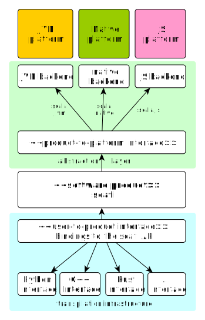

# Master thesis notes

This document is a live document tracking the progress and development of my master thesis project.
It will be updated as the project evolves.

## Goals

**Problem Statement**: Scafi is a programming model for aggregate computing that enables writing distributed programs in a high-level, declarative manner, based on _field calculus_.
The Scafi library is implemented in Scala and designed for the JVM platform.
Alternative implementations have been developed in different languages, including C++, Kotlin, and Rust to address performance needs or support different platforms, such as mobile or edge devices, and to improve the usability (_alignment problem_).
However, these implementations have been created independently from scratch, with no code reuse, and no compatibility in mind.

More generally, abstracting away from Scafi, the **goal** of the thesis is to investigate the feasibility of a multi-platform and multi-language architecture for Scafi, allowing to target different platforms (JVM, native, web) and programming languages (Scala, Kotlin, C++, Python, Rust, etc.) while maintaining a consistent API written in Scala.

More in details, the thesis aims to:

- define an extensible architecture allowing to target heterogeneous devices, both JVM-based and native, and to support web and non-web environments;
- nimbly support the development of programs in various languages, such as (but not limited to) C++, Python, Kotlin, and Rust.

<!-- In the end the contribution of this thesis should enable the aggregate programming community to effortlessly use Scafi in diverse computational environments and with different programming languages. -->

## Requirements

-- Requirements are still incomplete and need to be refined --

### Functional requirements

#### User requirements

1. The library client should be able to write programs in different supported languages through a consistent API. Supported languages must include:
   - _TBD_
2. The library client should be able to target different platforms, including:
   - JVM-based platforms;
   - native platforms;
   - web platforms.

#### System requirements

1. The core abstractions and API implementation should be shared across all supported languages and platforms.
2. The system should provide the ability to target different platforms through a consistent user-side API for each supported language.
3. The infrastructure should provide a mechanism to automatically generate user-side API bindings for each supported language so that any change can be automatically propagated without manual intervention.

   - A desiderata in the long run!

4. Programs written in different languages should exhibit equivalent behavior, regardless of the platform.
5. Full compatibility with existing programs.

### Non-functional requirements

1. Performance: _TBD_
2. Extensibility: the architecture should allow for easy addition of new language bindings and platform-specific optimizations / logic.
   - _TBD what is meant by "easy"_
3. Reliability: the architecture should ensure robustness in program execution across platforms with clear error reporting.
4. The user-side API should be idiomatic to the target language, providing a seamless experience for the library client.

## Introduction

- one choose the language and its associated platform to address the abstraction gap;
- the choice is primarily driven by the application domain and the programming language ecosystem (libraries, tools, etc.);
- different fields of application have different needs;
  - AI-related applications prefer Python;
  - MAP-related applications prefer JVM;
  - Web-related applications prefer JS;
  - Performance-related applications prefer C/C++;
  - ...
- what about reusing the same codebase?
  - Scala, like other modern languages like Kotlin and Gleam, target different platforms: JVM, JavaScript and Native;
  - typical scenario: a scala application (`main`) is compiled to different platforms in order to be run on both JVM, JS and Native.
    - pros:
      - the code is fully written in Scala and compiler is used to generate the code for the different platforms;
    - cons:
      - Scala ecosystem is not a fits-all solution: e.g., when developing AI applications, the Scala ecosystem is not as rich as the Python ecosystem => one may want to use the library directly from Python;
- Scala Native and Scala.js support the export of APIs to C and JS respectively
  - Challenge: how to reuse most of the codebase and at the same time provide a consistent API for the different platforms?

## Coarse grained architecture

The architecture follows the Basilisk architectural pattern [^1] which aims to establish clear boundaries to decouple software products from both the underlying platforms and user-end programming languages.



Highlights:

- the abstraction layer leverages scala multi-platform compiler capabilities, targeting JVM, Javascript and Native platforms.
  - the _product-to-platform_ interface is a contract defining the platform-specific functionalities, which are appropriately implemented in each supported backend according to the target platform.
  - an adapter of the exposed API will be implemented to be accessible from all the platforms.
    - for example, in native platform, leveraging scala native, an adapter will be implemented to make the API accessible from native languages through C ABI.
- the transpilation infrastructure allow to generate a consistent user-side facade over the scafi API, tailored to the specific target language of choice (similarly to the approach described in [^1]).
  - important: the _user-to-product_ interface contains only the bindings to access the software product, implemented using a _foreign function interface_ (FFI) library for the specific targeted language.
    - for example, when targeting the native platform, the transpilation infrastructure must be able to generate bindings via the C ABI using ad-hoc FFI libraries (e.g. [`swig`](https://www.swig.org/)).

Challenges to address:

- shared code must use _cross-platform_ libraries and features;
  <!--
  - currently scafi `spala` module leverages Akka actors, which is not _cross-platform_;
  -->
- API automatic generation is not trivial (actually, very hard!);
- for native platforms crafting a facade over the API that can be called from another language using a FFI is not trivial;
- some specific language adapter may be required to better fit the target language idioms and conventions.

The implemented architecture taking inspiration from the Basilisk pattern:

> **Goal**: make a scala-based framework, where our API is in Scala and through a "depowered Scala" facade we find ways to connect to other languages, and other-backends (platforms).


- for targeting native platform, [Scala Native](https://scala-native.org/en/stable/) is used.

  - ahead of time compiler + runtime;
  - it provides scala bindings for C programming constructs, standard library and a core subset of POSIX libraries, making it interoperable with C code;
  - leveraging sbt [cross-project plugin](https://github.com/portable-scala/sbt-crossproject) it is possible to compile for native platform and generate shared / static libraries;
  - ! scala native do not generate header files for the C code (differently from Kotlin Native)
    - A library that can help generating bindings for C libraries is [Scala Native Bindgen](https://sn-bindgen.indoorvivants.com) even if in our case we don't have an external C library to bind to but we want to expose a C API for our scala code
  - ! still not mature. some limitations exists (see [limitations below](#limitations))

- Python use FFI libraries to interact with Native code:

  - `cffi` support [pyhton code embedding](https://cffi.readthedocs.io/en/stable/embedding.html)
  - `swig` support different languages
  - how to generate it?

- for Js platform, [Scala.js](https://www.scala-js.org/) is used.


<!--
## Work plan

The initial work plan is to start with a proof of concept to validate the architecture.

1. Implementation of a simple DSL inspired to the _Sapere_ incarnation using scala multi-platform;
2. creation of a native interoperable layer over the DSL that make it possible to call it using FFI libraries in other programming languages;
3. creation of a minimal transpilation infrastructure inspired to Hydra [^1], initially for a small set of languages;
4. add distribution;
5. creation of a JS interoperable layer
-->

## Proof of concept

The selected proof of concept for testing the feasibility of the architecture is the case of Distributed Asynchronous Petri Nets.

The code is available [here](https://github.com/tassiluca/dap).

### Limitations

Limitations mostly occur when using Scala Native, which is less mature than Scala.js.

- `@exported` can only be used on `native` and not in `shared` code;
- C interop doesn't allow to export classes and structs cannot be passed directly to C functions (a pointer to the struct must be passed instead);
  - https://github.com/scala-native/scala-native/issues/897
- functions needs to be `inline`d becuase of compiler needs to generate type information at compile time (`Tag` type class);

```scala
/* Currently, it is not possible to use `CFuncPtrN` as reification of agnostic function types
* because, since the C types are not automatically generated from the agnostic types,
* when we need to convert a Scala function using an agnostic type back to a C function
* we would need to perform a conversion of the input argument like this:
*
* {{
*    val updateFn: CFuncPtr1[Ptr[CState], Unit] = ??? // some C callback provided by the C client
*    val f = CFuncPtr1.fromScalaFunction[State[CToken], Unit]: s =>
*      updateFn(s /* using Conversion[State[CToken], Ptr[CState]] */)))
*              ^^^^^^^^^^^^^^^^^^^^^^^^^^^^^^^^^^^^^^^^^^^^^^^^^^^^^^
*    Closing over local state of parameter updateFn in function transformed to CFuncPtr
*    results in undefined behaviour
* }}
*
* But this is actually forbidden! When Scala Native allows to support automatic conversion
* of agnostic types to C types, we should be able to use `CFuncPtrN`.
*/
override type IFunction1[T1, R] = T1 => R
```

### Capabilities

One important aspect is how to make the Native API generic:

- for generic types opaque pointers are used;
- the scala code only knows the generic type is a pointer to an opaque structure, hence it can only pass it around without knowing its internals, while the C code knows the actual implementation of the structure and can properly interact with it
- _side effect_: all the operations that need to work on the internals of the generic types must be implemented in C and make them available to the scala code
  - this is also necessary, for example, to implement the distribution layer for (un)marshalling the data structures
  - callbacks, reified in Scala as Type Tags or capabilities

Goal: avoid creating ugly APIs passing _strategies_ like this:

```scala
    def simulation[Token](
        rules: ISeq[Rule[Token]],
        initialState: State[Token],
        neighborhood: ISeq[Neighbor],
        serializer: IFunction1[Token, IString], // <- strategy
        deserializer: IFunction1[IString, Token], // <- strategy
        equalizer: IFunction2[Token, Token, Boolean], // <- strategy
    ): DASPSimulation[Token]
```

And, instead, replace them with standard-multiple-platoforms serialization libraries.

|               | Protocol Buffers                    | Apache Thrift          | Avro                                  |
| ------------- | ----------------------------------- | ---------------------- | ------------------------------------- |
| Binary format | Yes                                 | Yes                    | Yes + json                            |
| Generate code | C(++), Java, Python, Dart, Go, Ruby | + Js, Erlang, PHP, ... | Yes but for dynamic PL can be avoided |

<!--

### 1 + 2) Multi-platform and native interoperable layer

- the data structures and methods that are part of the public API have been re-written using C programming constructs (e.g. `struct` and prototypes) so that from C it is possible to properly interact with them $\Rightarrow$ this incarnates the _native interoperability protocol_ [^2]

  - scala shared data structures are converted in their C counterparts back and forth using appropriate conversion methods
  - the C prototypes are implemented in scala native and linked to the C code during the compilation phase (through `@exported` methods in scala native)
  - _transpilation infrastructure_ will be in charge of generating this

Open questions:

1. `cffi` and other FFI libraries require the opaque data types to be defined in the header file (see the [tasks](https://github.com/tassiluca/dap/blob/0b278c4359735f7076d8f9058318b60decdb629a/dap-native-examples/tasks.py#L55) used to build the C API for Python). The transpilation infrastructure should be able to generate the header files enriched with the C concrete types

2. The examples implemented so far uses opaque pointers. The behavior is programmed using simple rewrite rules where the state is generic in `T` and all the rules are defined in terms of `T`. This is a limitation that must be addressed now?

   1. maybe it is necessary to replace opaque pointers with `void*` (and use a type tag to distinguish the actual type of the pointer)

3. For the moment the Python wrapper code have been written manually. Moving towards point 3. of the work plan, is it possible to automate this in the transpilation infrastructure?
   - things to be taken in consideration:
     1. it is very hard to debug
     2. beware garbage collection free memory
     3. the generated code can be idioamtic?
     4. how to document the generated code?


-->

[^1]: [When the dragons defeat the knight: Basilisk an architectural pattern for platform and language independent development](https://www.sciencedirect.com/science/article/pii/S016412122400133X?via%3Dihub)
[^2]: https://faultlore.com/blah/c-isnt-a-language/
